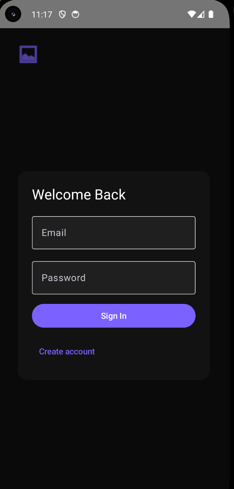
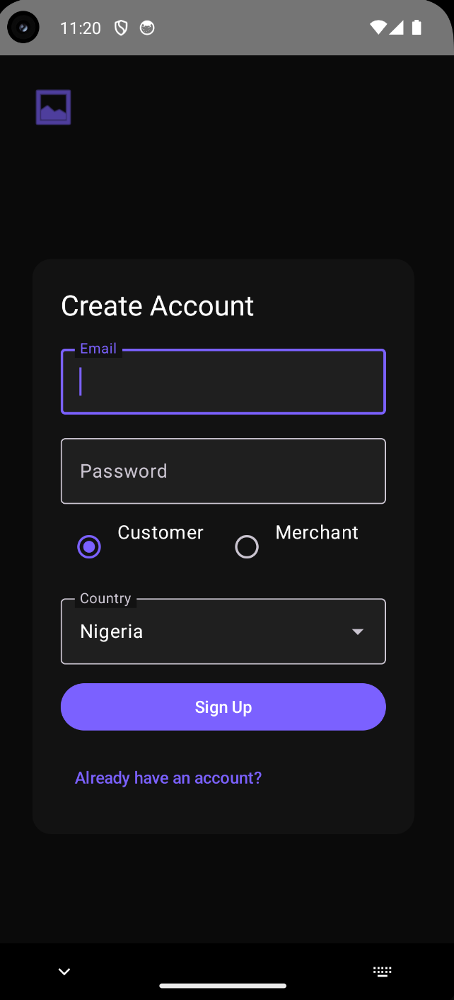
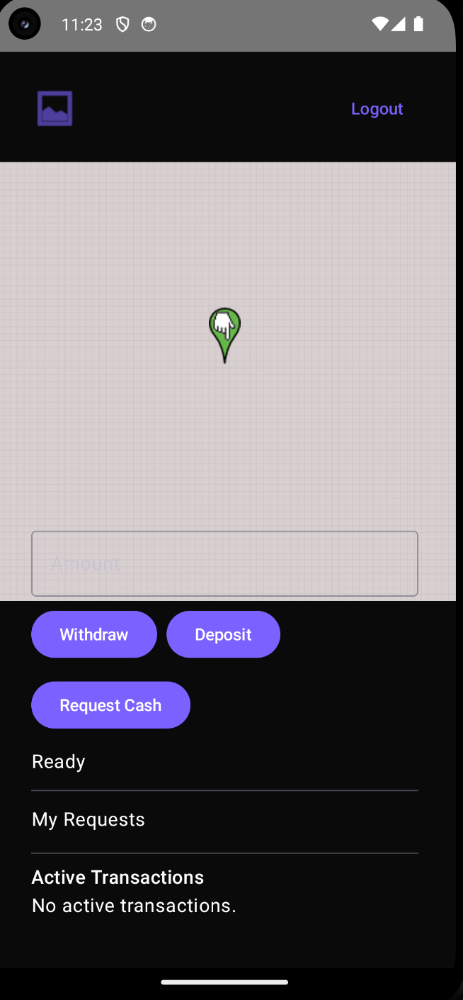
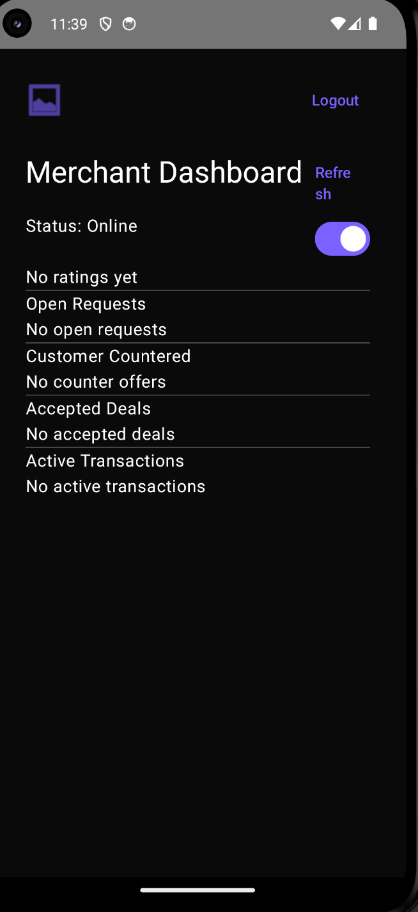

# P-Port

P-Port is a mobile fintech platform designed for regions where ATM infrastructure is limited and POS agents are the primary access point for cash withdrawal and deposit services.

Instead of users searching for a POS merchant, P-Port enables on-demand matching between customers and nearby merchants, allowing cash access through a request → offer → negotiation → transaction → confirmation workflow.

---

## 🚀 Core Idea

A "mobile ATM network" where POS merchants move toward demand instead of users searching for availability.

---

## 📱 Tech Stack

- Frontend: Kotlin (Android Studio)
- Backend: Supabase (Auth, Database, Triggers)
- Server Logic: Supabase Edge Functions
- Real-time updates via Supabase subscriptions

---

## 🔄 Core User Flow
Customer → creates cash request
Merchant → sees request → sends offer
Customer → accepts or counters offer
Merchant → accepts final terms
System → creates transaction
Both parties → confirm completion
Customer → rates merchant
Receipt → generated automatically

---

## ✅ What Works End-to-End (Current Production State)

### 🔐 Authentication
- Email/password sign-up & login
- Role selection (Customer / Merchant)
- Country selection (ISO2 format)
- Session token + user ID stored locally

### 👤 Profile System
- Auto-profile creation via database trigger
- Stores: user ID, role, country

### 📍 Customer Side
- Map container renders successfully
- Cash request creation works
- Requests are written to `requests` table
- Calls `create-request` Edge Function

### 🧑‍💼 Merchant Side
- Can view open & negotiating requests
- Fetches live request list from backend
- Sends offers stored in `offers` table

### 🤝 Offer System
- Customers receive offers in real time
- Customers can:
    - Accept offer
    - Counter offer
- Accept triggers `accept-offer` Edge Function

### 💳 Transaction System
- Transaction created after offer acceptance
- Both parties must confirm completion
- Once both confirm → transaction closes

### ⭐ Ratings
- Customer can rate merchant after completion
- Merchant rating is aggregated and displayed

### 🧾 Merchant Setup
- Merchant registration screen available
- Stores POS ID and bank/subaccount details

---

## ⚙️ Current System Status

The core loop is fully functional:

> Request cash → Merchant offers → Negotiation → Agreement → Transaction → Confirmation → Rating

This entire lifecycle works in the current build, except payment execution.

---

## 🚧 What Is Not Yet Implemented

### 💰 Payment Integration (Flutterwave)
- Edge function for payment initialization is not deployed
- No real money transfer is triggered yet
- Transaction flow is simulated up to confirmation stage

---

## 🧠 Architecture Overview

- **Android App (Kotlin)** handles UI, state, and user actions
- **Supabase Auth** manages users and sessions
- **PostgreSQL tables** store:
    - users
    - profiles
    - requests
    - offers
    - transactions
    - ratings
- **Edge Functions** handle:
    - request creation logic
    - offer acceptance logic
    - transaction creation logic
- **Real-time subscriptions** power live updates (offers & requests)

---

## 📦 Database Design (High Level)

- `profiles` → user metadata
- `requests` → cash requests from customers
- `offers` → merchant offers
- `transactions` → confirmed deals
- `ratings` → post-transaction feedback

---

## 🎯 Project Vision

To build a decentralized cash access network for emerging markets where:

- ATM access is limited
- POS agents are the primary financial infrastructure
- Users can request cash the same way they request rides

---
## 📸 Screenshots

### Authentication Flow

| Login | Sign Up |
|------|--------|
|  |  |

---

### Main App Screens

| Customer Home | Merchant Home |
|--------------|---------------|
|  |  |

## 👨‍💻 Author

Emoghene Mukoro  
LinkedIn: https://www.linkedin.com/in/emoghene-mukoro-779bb8362